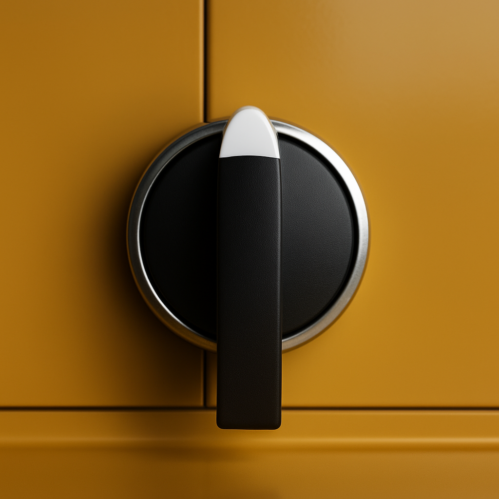
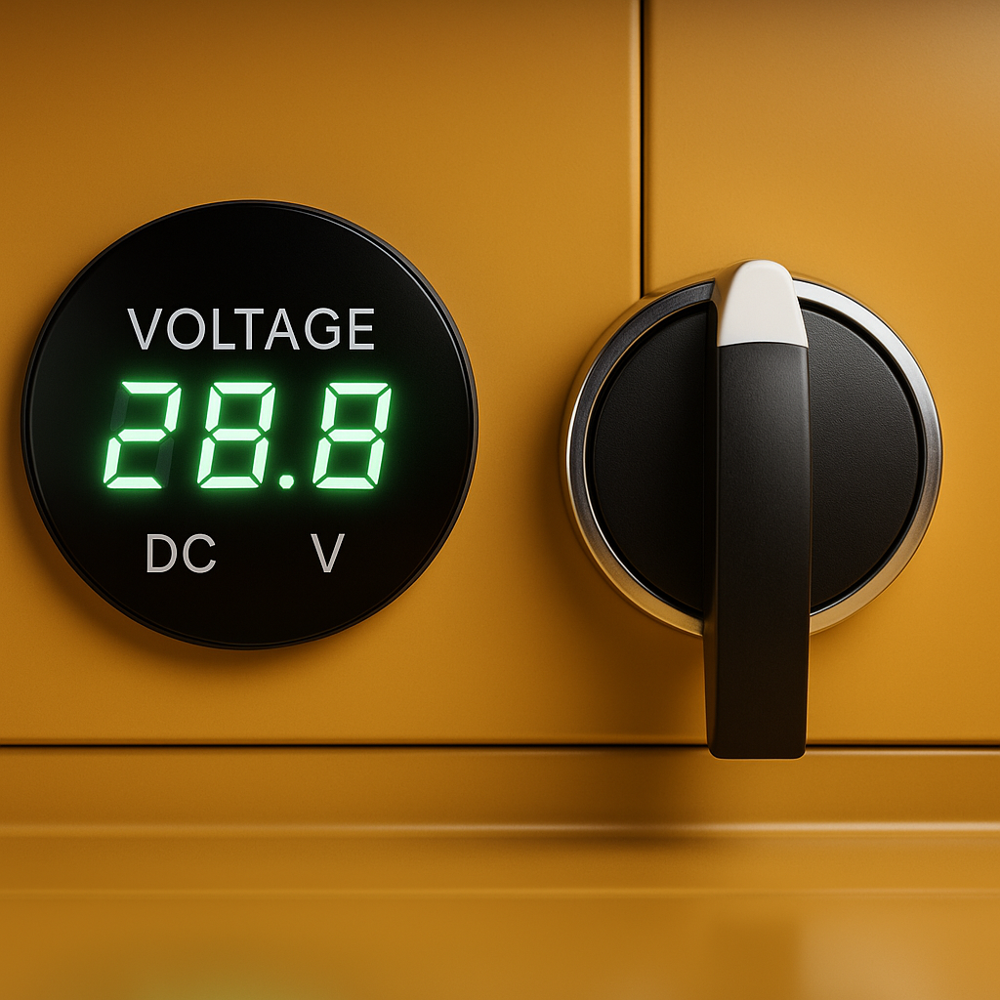
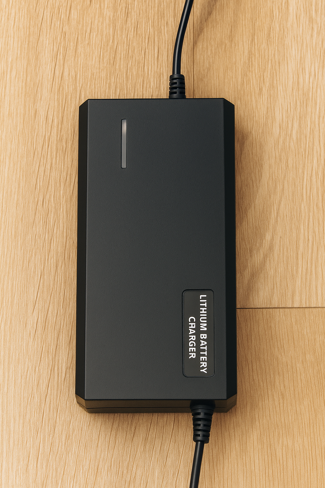
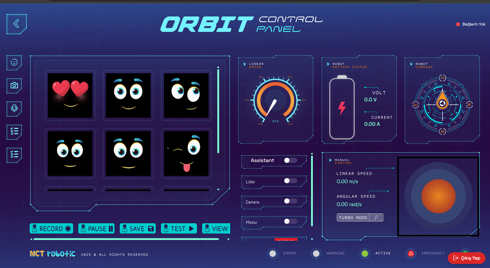
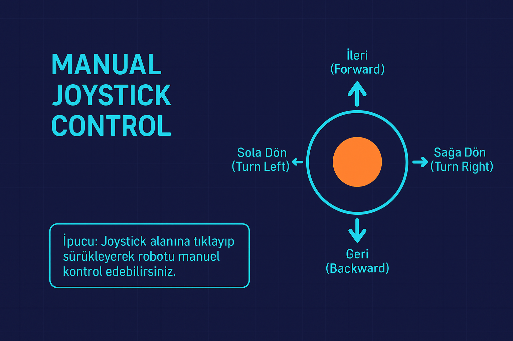
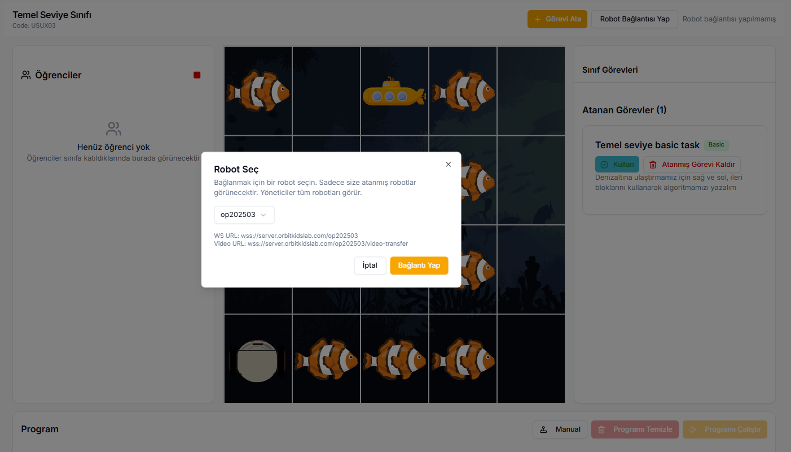
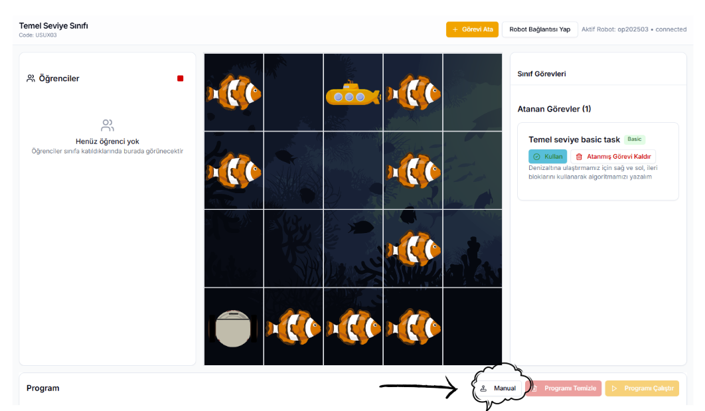
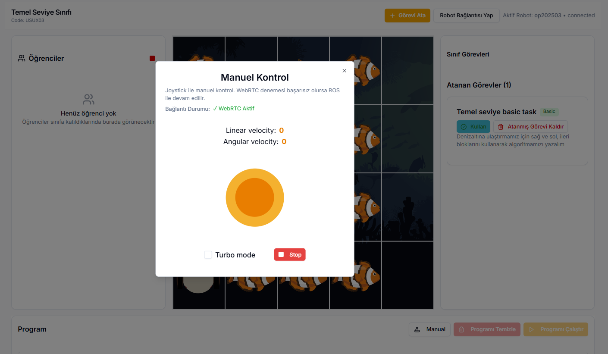

### Robot İlk Kullanım

  
  Robot üzerindeki siyah konum anahtarı üç pozisyona sahiptir:  

  Sol konum: Robot aktif (çalışma modu)  

  Orta konum (0): Robot kapalı  

  Sağ konum: Şarj modu aktif

  
  

 

  
  Voltaj Göstergesi  22.0 ile 29.0 arasında şarj değerini robot açıkken gösterir.
  

 

  
  Robot üzerinde iki adet acil durdurma butonu bulunmaktadır. Bu butonlar, robotun ana gücüne bağlıdır ve basıldığında güvenlik nedeniyle robotun gücünü keser. Buton serbest bırakıldığında sistem yeniden başlatılır.  
Acil durdurma butonunun, gösterildiği şekilde açılması gerekmektedir. Ters yönde döndüğünde butonun ömrü kısalmaktadır.
Robotu başlatırken acil durdurma butonları basılıysa, robot açılmaz. Siyah butonu ortaya alarak acil durdurma butonları kapatılmalı ve ardından robot tekrar açılmalıdır.
  

 

#### Başlatma Süreci

Robotun başlatma süreci, donanım bileşenlerinin ve sensörlerin düzgün şekilde çalıştığının doğrulanması amacıyla otomatik olarak gerçekleştirilir.   
İşlem Adımları:  

1. Güç Verilmesi:     Robot enerji aldığında sistem başlatma dizisi otomatik olarak başlar.   

2. LED Göstergesi – Durum 1:   Başlangıç aşamasında şerit led kırmızı renkte yanar. Bu durum, sistem kontrolünün devam ettiğini belirtir.   

3. Sistem Kontrolü:   

· Ana kart, sensörler ve iletişim arabirimleri kontrol edilir. 

· Servo motorlar ve hareket bileşenleri bekleme konumuna alınır.   

4. Kafa Mekanizması Kalibrasyonu:   

· Kafa eksenleri sıfır (referans) konumuna getirilir. 

5. LED Göstergesi – Durum 2:   Sistem kontrolü ve kalibrasyon işlemleri başarıyla tamamlandığında şerit led yeşil renge döner.   

6. Sesli Uyarı: İnternet bağlantısı varsa ve başarılı başlatma işlemini doğrulandıysa sistem kısa bir sesli uyarı sinyali üretir.(Haydi Başlayalım der)   

7. Başlatma Tamamlandı: Robot, normal çalışma moduna geçer ve kullanıcı komutlarını kabul etmeye hazır hâle gelir.   
Notlar:  

· Eğer başlatma süreci sırasında bir hata algılanırsa, LED’ler kırmızı yanmaya devam eder ve sistem çalışmayı durdurur.  
· Hata kodları ve sinyal desenleri, sistem hata tablosunda tanımlanmıştır. 
  

#### Şarj Etme ve Batarya Kullanma İşlemi

  
  Konum anahtarının orta (0) konumunda, yani robot kapalı durumda olduğundan emin olun.    
  Şarj adaptörünün soketini robot üzerindeki şarj girişine güvenli şekilde bağlayın.    
  Şarj işlemini başlatmak için konum anahtarını sağa çevirin.    
  Şarj işlemi tamamlandığında anahtarı tekrar 0 (orta) konumuna alın.    
  Şarj soketini yalnızca anahtar 0 konumundayken çıkarın.

  

 

  Robotun güç kaynağı, yüksek verimli bir lityum batarya ile sağlanmaktadır. Şarj işlemi, sisteme entegre edilmiş lityum batarya şarj cihazı (Lithium Battery Charger) aracılığıyla gerçekleştirilir. Cihaz, güvenli şarj yönetimi için akım ve gerilim değerlerini otomatik olarak denetler.  
    Şarj cihazı üzerindeki gösterge LED’leri, şarj durumunu kullanıcıya bildirir:  

  · Kırmızı ışık yandığında batarya şarj olmaktadır. 

  · Yeşil ışık yandığında ise şarj işlemi tamamlanmıştır ve batarya kullanıma hazırdır.
  

  

#### Uyarılar ve Güvenlik Önlemleri

    
  · Konum anahtarı sağ konumdayken, robot üzerindeki şarj soketi elektrik altındadır; soket uçlarına elle dokunmayın.   

· Buton sağ konumdayken soket ve bağlantı noktalarını iletken malzemelerle temas ettirmeyin (metal aletler, anahtar, kablo uçları vb.).   

· Şarj aleti prize takılıyken, şarj adaptörünün kendi soket uçlarında da elektrik bulunur; adaptörün uçlarına kesinlikle dokunmayın.   

· Şarj soketinin takma ve çıkarma işlemlerini mutlaka 0 (orta) konumunda gerçekleştirin.    

  · Teslim sırasında verilen eğitimde belirtilen tüm güvenlik kurallarına uyun.   

· Yalnızca üretici tarafından önerilen ve uyumlu şarj adaptörlerini kullanın.   

· Kablo veya sokette hasar tespit edilmesi durumunda şarj işlemine devam etmeyin; teknik servise başvurun.   

· Şarj sırasında robotu aşırı sıcaklık, sıvı teması veya yanıcı yüzeylerden uzak tutun.

  

   
#### Kullanım Modları

<h5>Manuel Kullanım</h5>

Manuel kullanıma iki yerden erişelebilir:

1. Robot sayfasındaki kontrol panelden robot kontrol ile joystick kullanımı;

  
  ➡️ 
  

2. Öğretmen Panelindeki sınıflara girilip robot bağlantısı sağlandıktan sonra manuel butonu ile gelen joystick kullanımı;

  

  

  

<h5>Otonom Kullanım</h5>

Otonom kullanım için navigasyon moduna geçilmesi gereklidir. Navigasyon modu detatylı olarak ------------------ kısmında anlatılmaktadır.

<h5>Kalibrasyon</h5>

Robot kafa ve çizgi izleyen olmak üzere iki kısımda kalibrasyon alır.
Robot açıldığı anda kafa kalibrasyonunu şekilde gösterilen videodaki gibi alır.

  <iframe 
      width="560" 
      height="315"
      src="https://www.youtube.com/embed/BlsB2-nDhgk" 
      title="YouTube video player"
      frameborder="0"
      allow="accelerometer; autoplay; clipboard-write; encrypted-media; gyroscope; picture-in-picture"
      allowfullscreen>
  </iframe>

### LED Komut Tablosu

<h3>🟩 Mat Üzeri LED Durumları</h3>
<table>
  <tr><th>Komut Adı</th><th>Mod</th><th>Renk</th><th>Açıklama</th></tr>
  <tr><td>ileri</td><td>2</td><td style="background-color:cyan;color:black;">Camgöbeği</td><td>İleri hareket — yanıp sönme efekti</td></tr>
  <tr><td>right</td><td>2</td><td style="background-color:yellow;color:black;">Sarı</td><td>Sağa dönüş — yanıp sönme efekti</td></tr>
  <tr><td>left</td><td>2</td><td style="background-color:yellow;color:black;">Sarı</td><td>Sola dönüş — yanıp sönme efekti</td></tr>
  <tr><td>error</td><td>2</td><td style="background-color:red;color:white;">Kırmızı</td><td>Genel hata — kırmızı yanıp sönme</td></tr>
</table>

<h3>🌐 İnternet Durumları</h3>
<table>
  <tr><th>Komut Adı</th><th>Mod</th><th>Renk</th><th>Açıklama</th></tr>
  <tr><td>online</td><td>3</td><td style="background-color:lime;color:black;">Yeşil</td><td>Cihaz çevrimiçi — parlaklık azalma</td></tr>
  <tr><td>hotspot</td><td>3</td><td style="background-color:orange;color:black;">Turuncu</td><td>Hotspot aktif — turuncu parlaklık azalma</td></tr>
  <tr><td>change_mode</td><td>3</td><td style="background-color:yellow;color:black;">Sarı</td><td>Mod değişimi sırasında uyarı</td></tr>
</table>

<h3>🤖 Navigasyon Durumları (nav2)</h3>
<table>
  <tr><th>Komut Adı</th><th>Mod</th><th>Renk</th><th>Açıklama</th></tr>
  <tr><td>reached</td><td>5</td><td style="background-color:lime;color:black;">Yeşil</td><td>Hedefe ulaşıldı</td></tr>
  <tr><td>active</td><td>6</td><td style="background-color:cyan;color:black;">Camgöbeği</td><td>Aktif navigasyon</td></tr>
  <tr><td>status</td><td>5</td><td style="background-color:deepskyblue;color:white;">Açık Mavi</td><td>İstasyon ekleme/silme işlemi</td></tr>
  <tr><td>complate</td><td>2</td><td style="background-color:lime;color:black;">Yeşil</td><td>Görev tamamlandı</td></tr>
</table>

<h3>🚨 Hata Kodları</h3>
<table>
  <tr><th>Kod</th><th>Mod</th><th>Yanıp Sönme Sayısı</th><th>Renk</th><th>Açıklama</th></tr>
  <tr><td>error 1</td><td>4</td><td>1</td><td style="background-color:red;color:white;">Kırmızı</td><td>[1] Navigasyon hatası (nav2 failed)</td></tr>
  <tr><td>error 2</td><td>4</td><td>2</td><td style="background-color:red;color:white;">Kırmızı</td><td>[2] Batarya hatası</td></tr>
  <tr><td>error 3</td><td>4</td><td>3</td><td style="background-color:red;color:white;">Kırmızı</td><td>[3] IMU'dan yanlış veri gelmesi</td></tr>
  <tr><td>error 4</td><td>4</td><td>4</td><td style="background-color:red;color:white;">Kırmızı</td><td>[4] İnternet bağlantısı yok</td></tr>
  <tr><td>error 5</td><td>4</td><td>5</td><td style="background-color:red;color:white;">Kırmızı</td><td>[5] Genel Sensör Hatası</td></tr>
  <tr><td>error 6</td><td>4</td><td>6</td><td style="background-color:red;color:white;">Kırmızı</td><td>[6] Navigasyon Hatası</td></tr>
  <!-- <tr><td>errors_7</td><td>4</td><td>7</td><td style="background-color:red;color:white;">Kırmızı</td><td>[7] Tanımlanmamış hata 7</td></tr>
  <tr><td>errors_8</td><td>4</td><td>8</td><td style="background-color:red;color:white;">Kırmızı</td><td>[8] Tanımlanmamış hata 8</td></tr>
  <tr><td>errors_9</td><td>4</td><td>9</td><td style="background-color:red;color:white;">Kırmızı</td><td>[9] Tanımlanmamış hata 9</td></tr> -->
</table>

