## Orbit Bloğunun Açıklaması

  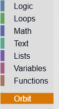
  Medium Task içinde bulunan "Orbit" sekmesindeki blokların detaylı açıklanması ve verilecek değerlerin ksıtları.
  

### ROBOTUN YÖNÜ VE HAREKETİ
Mavi bloklar, robotun yön ve hareket davranışlarını belirler.

  
  Robot, bu blokta belirtilen değer kadar metere ileri hareket eder ve hareket tamamlandıktan sonra durur.  
    Mesafe (metre) : Robotun ilerleyeceği mesafe değeridir.  
    Geçerli aralık : 0.2 ≤ mesafe ≤ 1.0
  

 

  
  Robot, bu blokta belirtilen değer kadar metere geri hareket eder ve hareket tamamlandıktan sonra durur.  
    Mesafe (metre) : Robotun geri gideceği mesafe değeridir.  
    Geçerli aralık : 0.2 ≤ mesafe ≤ 1.0
  

 

  
  Bu blok, robotun sağ yöne belirli bir açı kadar dönmesini sağlar. Blok çalıştırıldığında robot, girilen derece değerine göre saat yönünde döner ve dönüş tamamlandığında durur.  
    Açı (derece) : Robotun döneceği açı miktarını belirtir.
    Geçerli değer aralığı : 0° - 360°

  

 

  
  Bu blok, robotun sol yöne belirli bir açı kadar dönmesini sağlar. Blok çalıştırıldığında robot, girilen derece değerine göre saat yönünün tersine döner ve dönüş tamamlandığında durur.  
    Açı (derece) : Robotun döneceği açı miktarını belirtir.
    Geçerli değer aralığı : 0° - 360°

  

 

  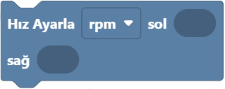
  Bu blok, robotun tekerleklerini ayrı ayrı kontrol ederek istenen yönde hareket etmesini sağlar.
    Her bir tekerleğe verilen değer, o tekerleğin dönme hızını (RPM – dakika başına devir) belirtir.  
    Bu aralığın dışındaki değerler hatalı çalışmaya neden olabilir.  
    Geçerli değer aralığı: -15 ≤ hız ≤ 15  
    Not: Bu aralığın dışında girilen değerler motorun hatalı çalışmasına neden olabilir.
  

 

| HAREKET  TÜRÜ   | SOL TEKER   | SAĞ TEKER   |
|:----------------|:-----------:|------------:|
|İleri            |  10         | -10         |
|Geri             | -10         |  10         |
|Sağa 90° Dönüş   |  10         |  10         |
|Sola 90° Dönüş   | -10         | -10         |

💡 NOT : 10 optimum değer olduğu için tablodaki örnekte 10 rpm kullanılmıştır.

 

  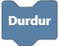
  Bu blok, robotun motorlarını durdurmak için her iki tekerleğe de 0 RPM değeri gönderir.
    Bu sayede tekerleklerin dönme hareketi sonlandırılır ve robot hareketsiz konuma geçer.
  

### ROBOTUN SENSÖRLERİ

{ width=400px }

  
  Mesafe sensörü, çevresindeki nesnelerin uzaklığını ölçer ve sistem kontrol birimine iletir.  
  Mesafe (metre) : Ölçtüğü birim metredir.
  Ölçüm aralığı : 0.2 ≤ veri ≤ 1.0
  

 

  
  LDR sensörü, ortam ışık seviyesini ölçer ve analog değer olarak sistem kontrol birimine iletir. 
  Mesafe (metre) : Ölçtüğü birim metredir.
  Ölçüm aralığı : 0 ≤ veri ≤ 1023  
    0 (karanlık ortam)
    1023 (aydınlık ortam)
  

  

  
  Akım sensörü, robotun elektrik devresinden geçen akım değerini ölçer ve sistem kontrol birimine iletir. 
    Ölçüm aralığı :  0.0 ≤ veri ≤ 1.6 (Tekerleklerin zorlanmadığı durumda)  
   
  

 

  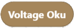
  Voltaj sensörü, robotun besleme hattındaki gerilim değerini ölçer ve sistem kontrol birimine iletir. Ölçümler Volt (V) cinsindendir.  
  Not: Eğer ölçülen gerilim 23 V’nin altına düşerse, kontrol sistemi robotu otomatik olarak kapatır (undervoltage shutdown).
   
  

 

  
  Sıcaklık sensörü, ortam sıcaklığını ölçer ve ölçüm sonucunu sistem kontrol birimine iletir. Ölçümler genellikle derece Celsius (°C) cinsindendir.  
    
   
  

 

  
  Tekerlek sensörlerinden elde edilen hız verisi, devir/dakika (RPM) cinsinden ölçülür ve ilgili sistem bileşenlerine iletilir. 
   
  

### GÖRSEL EFEKT ve KAFA HAREKET YÖNETİMİ

  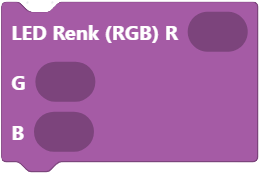
  Robot üstündeki şerit ledin rengini kontrol etmek için kullanılır.
    RGB, Kırmızı (Red), Yeşil (Green) ve Mavi (Blue) renklerinin
    karışımını temsil eder. Bu üç rengin değerini değiştirerek
    binlerce farklı renk oluşturabilir. Değerler 0 – 255 arasında
    değişir. 
   
  

 

  
  Robot üstündeki şerit ledin rengini kontrol etmek için kullanılır.
    RGB, Kırmızı (Red), Yeşil (Green) ve Mavi (Blue) renklerinin
    karışımını temsil eder. Bu üç rengin değerini değiştirerek
    binlerce farklı renk oluşturabilir. Değerler 0 – 255 arasında
    değişir. 
   
  
  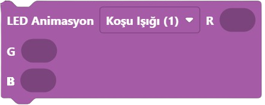

 

  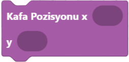
  Bu blok, robotun kafasının yatay (X) ve dikey (Y) eksenlerde hareket etmesini sağlar.  
  Hareket, adım adım kontrol edilir; yani verilen değer
  kadar adet adım (step) robot kafasını ilgili eksende
  hareket ettirir. 
  Geçerli değer aralığı:  
  x ekseninde [-216, 216] adım;  
  y ekseninde [-300,300] adım.
   
  

 

  
  Robotun yüz ifadesini kontrol eden bloktur. 12 farklı
mevcut yüz ifadesi vardır. 
   
  
  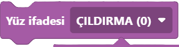

### ETKİLEŞİM ve SESLİ İLETİŞİM BLOKLARI

  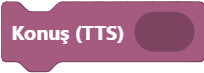
  Bu blok, robota doğrudan metin (string) göndererek konuşmasını sağlar. Gönderilen metin, robotun Text-to-Speech (TTS) motoru aracılığıyla seslendirilir.
  

 

  Bu blok, robotun internet üzerinden bir şarkıyı çalmasını sağlar. Kullanıcı sadece şarkının adını girer; blok şarkıyı internetten bulur ve oynatır.

 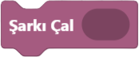

 

  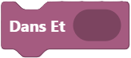
  Bu blok, robotun gelişmiş etkileşimli davranışlarını kontrol eder.  
        Kullanıcı bir metin girer; blok şunları eş zamanlı olarak yapar:  
• Metni internet üzerinden arar ve şarkıyı çalar.  
• Robotun ileri, geri, sağ, sol hareketlerini ve kafasının yukarı-aşağı
hareketlerini kullanarak dans figürleri gerçekleştirir.
 
   
  

