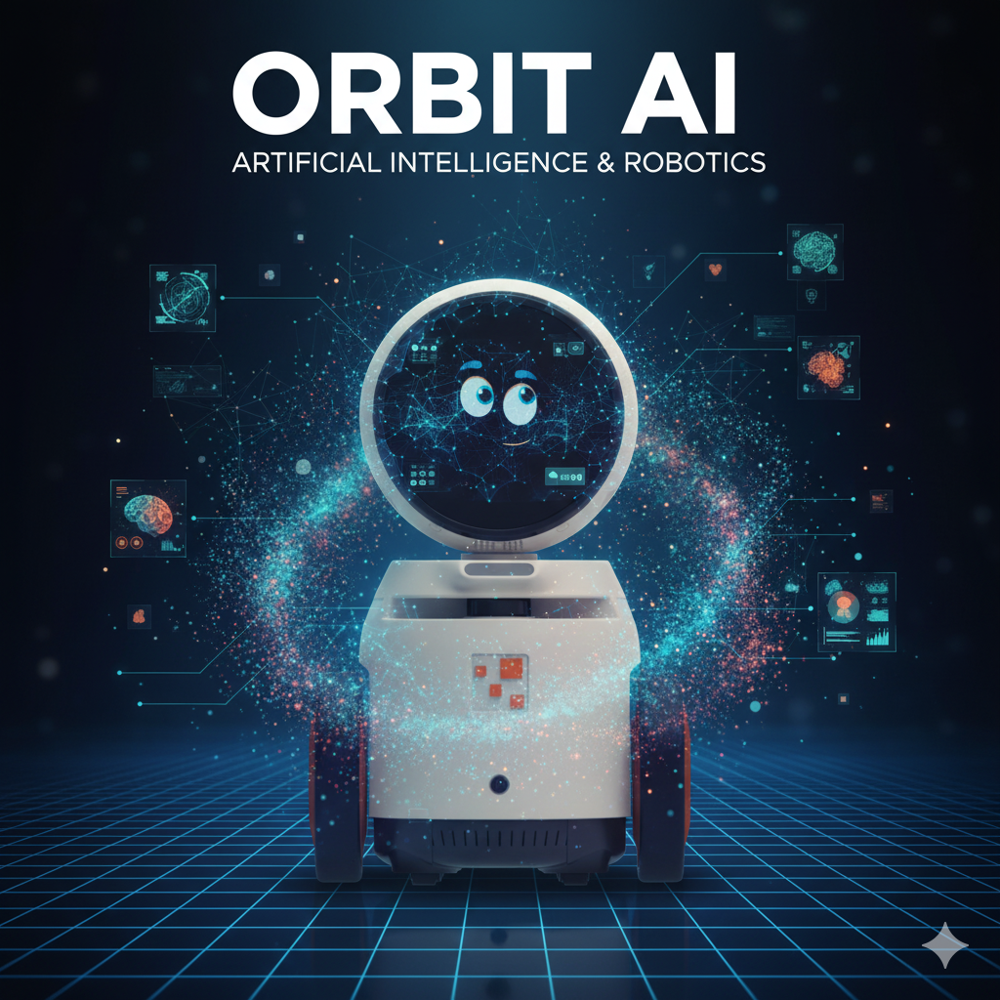

Orbit robotu, Büyük Dil Modelleri (LLM), Görüntü İşleme (Computer Vision) ve Konuşmadan Metne 
/ Metinden Konuşmaya (Speech-to-Text / Text-to-Speech) gibi yapay zekâ özelliklerini destekler. 
Ancak, Orbit Python kütüphanesi şu anda yalnızca Metinden Konuşmaya ve Görüntü İşleme 
özelliklerini desteklemektedir. Bu bölümde, özellikle Görüntü İşleme’ye odaklanarak Orbit 
AI’nin nasıl kullanılacağını inceleyeceğiz.

{ align=center width=50% }

## Text-to-Speech

Orbit robotunda yerleşik bir Metinden Konuşmaya (Text-to-Speech) modeli bulunmaktadır. Yapmanız 
gereken tek şey `text_to_speech` fonksiyonunu çağırmaktır.

**Örnek:**

```python
from orbitlab import Orbit

orbit = Orbit("ip-address")

orbit.text_to_speech("Merhaba, benim adım orbit.")

orbit.stop()
```

## Görüntü işleme

Bilgisayarlı İşleme (Computer Vision), robotların ve bilgisayarların kameralar veya sensörler 
aracılığıyla görsel bilgileri görmesini, yorumlamasını ve anlamasını sağlayan bir yapay zekâ alanıdır. 
Görüntüleri yakalama, işleme ve analiz etme süreçlerini kapsar; nesneleri tanır, hareketleri takip 
eder ve kararlar alır, böylece robotların çevresini anlamasını ve etkileşimde bulunmasını sağlar.

Yaygın kullanım alanları:

* **Robotik:** Engel tespiti, nesne tanıma, çizgi takip, insan takibi.
* **Endüstriyel otomasyon:** Kalite kontrol, barkod/QR kod okuma, sınıflandırma ve paketleme.
* **Otonom araçlar:** Şerit tespiti, trafik işareti tanıma, yaya algılama.
* **Yapay zekâ ve araştırma:** Yüz tanıma, jest algılama, çevresel haritalama (ör. SLAM).

### OpenCV'ye Giriş

OpenCV (Open Source Computer Vision Library), bilgisayarlı görü ve görüntü işleme için yaygın olarak 
kullanılan açık kaynaklı bir kütüphanedir. Python’da cv2 modülü üzerinden kullanılır ve şunları sağlar:

* Görüntü ve videoları okuma, yazma ve işleme
* Nesne tespiti, yüz tanıma ve hareket takibi
* Kamera kalibrasyonu ve artırılmış gerçeklik uygulamaları

!!! info "Kurulum"

    OpenCV’yi pip ile kurabilirsiniz:

    ```bash
    pip install opencv-python
    ```

**Basit Örnekler**

1. **Bir görüntüyü okuma ve gösterme**
    ```python
    import cv2

    # Görüntüyü oku
    image = cv2.imread('example.jpg')

    # Görüntüyü göster
    cv2.imshow('Görüntüm', image)

    # Bir tuşa basılana kadar bekle
    cv2.waitKey(0)

    # Tüm pencereleri kapat
    cv2.destroyAllWindows()
    ```

2. **Kameradan görüntü okuma**
    ```python
    import cv2

    # Varsayılan kamerayı aç (genellikle 0)
    cap = cv2.VideoCapture(0)

    # Tek bir kare yakala
    ret, frame = cap.read()

    # Kareyi göster
    cv2.imshow('Kamera Görüntüsü', frame)

    # Kamerayı serbest bırak ve pencereleri kapat
    cap.release()
    cv2.destroyAllWindows()
    ```

3. **Kameradan video yakalama**
    ```python
    import cv2

    # Varsayılan kamerayı aç
    cap = cv2.VideoCapture(0)

    while True:
        ret, frame = cap.read()
        if not ret:
            break

        # Video karesini göster
        cv2.imshow('Video Akışı', frame)

        # 'q' tuşuna basıldığında çık
        if cv2.waitKey(1) & 0xFF == ord('q'):
            break

    # Kamerayı serbest bırak ve pencereleri kapat
    cap.release()
    cv2.destroyAllWindows()
    ```

!!! note "Notlar"
    * `cv2.imshow()` görüntüleri veya videoları göstermek için pencere oluşturur.
    * `cv2.waitKey()` pencereyi yenilemek ve klavye girişini işlemek için gereklidir.
    * Video için döngü, çıkış yapılana kadar devam eder.
  
### Orbit Robot Kamerasını Kullanma

Orbit kameradan görüntü almak oldukça basittir. Yapmanız gereken tek şey `capture_image` 
fonksiyonunu çağırmaktır; bu fonksiyon, OpenCV ile işlenebilecek BGR formatında bir 
NumPy dizisi (array) döndürür.

**Örnek 1: Kameradan görüntü okuma**
```python
import cv2 
from orbitlab import Orbit

orbit = Orbit("<ip-address>")

frame = orbit.capture_image()

if frame is not None:
    cv2.imshow("image", frame)
    cv2.waitKey(0)

orbit.stop()  
cv2.destroyAllWindows()
```

**Örnek 2: Kameradan video yakalama**

```python
import cv2 
from orbitlab import Orbit

orbit = Orbit("<ip-address>")

while True:
    try:
        frame = orbit.capture_image()

        if frame is not None:
            cv2.imshow("image", frame)
            if cv2.waitKey(1) & 0xFF == ord('q'):
                break
    except KeyboardInterrupt:
        break

orbit.stop()  
cv2.destroyAllWindows()
```

### Robotlar için Bilgisayarlı Görü Projeleri

İşte Orbit üzerinde test edilebilecek bazı pratik robotik bilgisayarlı görü projeleri. 
Kod biraz ileri düzey görünebilir, bu yüzden dikkatlice ve adım adım öğretilmeli ve öğrencilerin 
temel OpenCV kavramlarına aşina olduğundan emin olunmalıdır.


1. Hareket algılama
    ```python
    import cv2
    import numpy as np
    from orbitlab import Orbit

    orbit = Orbit("<ip-address>")
    last_mean = 0
    threshold = 1.8
    while(True):
        frame = orbit.capture_image()
        cv2.imshow('frame',frame)
        gray = cv2.cvtColor(frame, cv2.COLOR_BGR2GRAY)
        result = np.abs(np.mean(gray) - last_mean)
        if result >= threshold:
            print("Hareket algılandı")
        last_mean= np.mean(gray)
        if (cv2.waitKey(1) & 0xFF == ord('q')):
            break
    orbit.stop()
    cv2.destroyAllWindows()
    ```

    !!! note "Notlar"

        * Sonuçlara göre `threshold` değerini ayarlayabilirsiniz. Bu değerin artırılması sistemin 
        hareket algılama doğruluğunu azaltır

        * Orbit robotu, hareket algılandığında konuşmasını sağlayabilir veya senaryoya göre alarm 
        tetikleyebilirsiniz. İşte Orbit’in 'Hareket algılandı' demesini sağlayan bir örnek.

            ```python
            ...
            # Orbit'e bir mesaj okut
            orbit.text_to_speech("Hareket algılandı")
            ...
            ```

2. Renk algılama
    ```python
    import cv2
    import numpy as np

    from orbitlab import Orbit

    # Renkler ve HSV aralıkları ile BGR görüntü renkleri tanımlanıyor
    colors = {
        "Red": ([136,87,111], [180,255,255], (0,0,255)),
        "Green": ([25,52,72], [102,255,255], (0,255,0)),
        "Blue": ([94,80,2], [120,255,255], (255,0,0))
    }

    orbit = Orbit("<ip-address>")

    # Maskeyi genişletmek için kernel tanımlıyoruz (morfolojik işlem)
    kernel = np.ones((5,5), np.uint8)

    while True:
        # Kameradan bir kare alıyoruz
        frame = orbit.capture_image()
        
        # BGR görüntüyü HSV renk uzayına çeviriyoruz
        hsv = cv2.cvtColor(frame, cv2.COLOR_BGR2HSV)

        # Her renk için döngü
        for name, (lower, upper, bgr) in colors.items():
            # Belirlenen renk aralığında maske oluştur
            mask = cv2.inRange(hsv, np.array(lower), np.array(upper))
            
            # Maske üzerinde genişletme (dilation) işlemi uyguluyoruz
            mask = cv2.dilate(mask, kernel)
            
            # Maskeden konturları bul
            contours, _ = cv2.findContours(mask, cv2.RETR_TREE, cv2.CHAIN_APPROX_SIMPLE)

            for cnt in contours:
                # Yeterince büyük konturlar ile ilgileniyoruz
                if cv2.contourArea(cnt) > 300:
                    # Konturun etrafına dikdörtgen çiz
                    x, y, w, h = cv2.boundingRect(cnt)
                    cv2.rectangle(frame, (x,y), (x+w,y+h), bgr, 2)
                    
                    # Renk adını görüntü üzerine yaz
                    cv2.putText(frame, f"{name} Colour", (x,y), cv2.FONT_HERSHEY_SIMPLEX, 1, bgr, 2)

        # İşlenmiş kareyi göster
        cv2.imshow("Multiple Color Detection", frame)
        
        # 'q' tuşuna basılınca döngüden çık
        if cv2.waitKey(10) & 0xFF == ord('q'):
            break

    # Kamerayı serbest bırak ve tüm pencereleri kapat
    cap.release()
    cv2.destroyAllWindows()

    ```