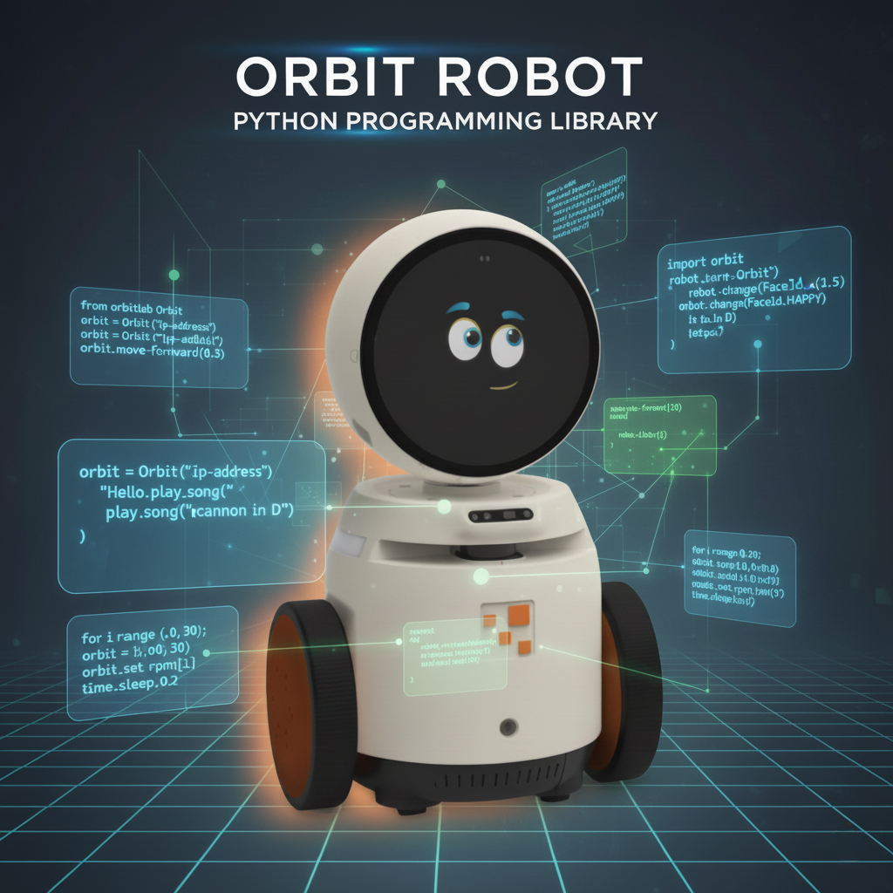

Bu bölüm, Orbit Python kütüphanesini ve Python ile robotik programlamanın temellerini tanıtmaktadır. 
Robot algısı, karar verme ve kontrol gibi temel kavramları öğreneceksiniz. Kütüphane, 
Orbit robotları için bir Python API’si sunar ve robotu Python soketi aracılığıyla kontrol 
etmenizi sağlar.

{ align=center width=50% }

## İçindekiler

1. [Başlarken](getting-started.md)
2. [Robotik programlama](robotic-programming.md)
3. [Orbit AI](orbit-ai.md)
4. [API Referansı](reference.md)

## Teşekkürler

Bu kütüphanenin geliştirilmesine katkıda bulunan açık kaynak topluluğuna ve Orbit ekibine teşekkür 
ederiz.