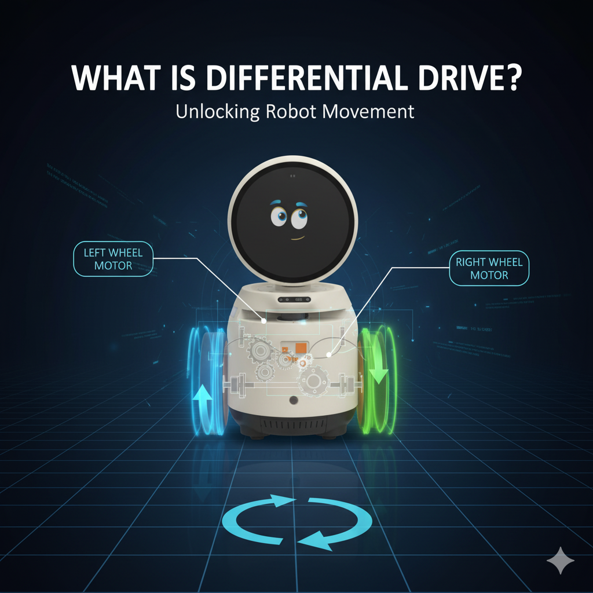

Bu bölümde, temel robotik programlama kavramlarını ve Orbit robot ile ilgili pratik örnekleri 
öğreneceğiz. Robot algılama, karar verme ve kontrol konularını tartışacağız.

##  Robot Algılama

Robot algısı, bir robotun çevresini sensörler ve veri işleme kullanarak anlaması yeteneğidir. 
İnsanların dünyayı görmek, duymak ve dokunmak yoluyla algıladığı gibi, robotlar da kameralar, 
LiDAR, ultrasonik sensörler, IMU’lar ve daha fazlasını kullanır.

{ align=center width=50% }


Orbit robot, LiDAR, kamera, IMU, ultrasonik sensörler, LDR’ler ve sıcaklık sensörleri ile donatılmıştır.
 Ancak bu Python kütüphanesi yalnızca ultrasonik, LDR, kamera ve sıcaklık sensörlerini desteklemektedir.

### Örnek

```python
import time
from orbitlab import Orbit

orbit = Orbit("<ip-address>")

while True:
    try:
        mesafe = orbit.distance_value()
    except KeyboardInterrupt:
        break

orbit.stop()
```

## Robot karar verme

Robot karar verme, bir robotun çevresinden algıladığı bilgilere dayanarak en iyi eylemi seçme sürecidir. 
Temel olarak, bir robotun hedeflerine ulaşmak için bir sonraki adımda ne yapacağına karar vermesidir.

Bunu, robotun algılama verilerini yorumlayıp eylemleri planlayan “beyni” olarak düşünebilirsiniz.

Yukarıdaki örneği kullanarak robotun yoluna bir engel çıktığında durmasını söyleyebiliriz.

### Örnek
```python
...
mesafe = orbit.distance_value()
if mesafe <= 30:
    orbit.set_rpm([0, 0])
...
```

## Robot Kontrolü

Robot kontrolü, bir robotun istenen eylemleri doğru ve güvenilir bir şekilde gerçekleştirmesini sağlama sürecidir.
 Bu, robotun aktüatörlerine (motorlar, servolar vb.) komut göndererek robotun istenildiği gibi hareket etmesini 
 veya davranmasını sağlar.

Basitçe: “**Kontrol, robotun aldığı kararları nasıl uyguladığıdır.**”

Orbit, diferansiyel sürüş ile kontrol edilebilen iki motorla donatılmıştır.

### Diferansiyel sürüş nedir?

{ align=center width=50% }

Diferansiyel sürüş, tekerlekli robotları hareket ettirmenin yaygın bir yöntemidir. Bu sistemde, robotun her iki 
yanında bağımsız olarak kontrol edilen iki tekerlek bulunur. Her tekerleğin hızı ve yönü değiştirildiğinde 
robot ileri, geri gidebilir veya kendi ekseni etrafında dönebilir.

**Nasıl Çalışır:**

| Sol Tekerlek | Sağ Tekerlek | Robotun Hareketi                     |
| ------------ | ------------ | ------------------------------------ |
| İleri        | İleri        | Düz ileri gider                      |
| Geri         | Geri         | Düz geri gider                       |
| İleri        | Durur        | Sağa döner (ekseni etrafında)        |
| Durur        | İleri        | Sola döner (ekseni etrafında)        |
| İleri        | Geri         | Yerinde döner (saat yönü veya tersi) |


**Örnek:**

1. Sol tekerlek 10 RPM hızla, sağ tekerlek -10 RPM hızla dönerse, robot **yerinde döner**.
```python
import time
from orbitlab import Orbit

orbit = Orbit("<ip-address>")
orbit.set_rpm([10, 10])  #sağ tekel fizksel ters -10 RPM yerine (-1 * -10) = 10 RPM
time.sleep(5)
orbit.stop()
```
2. **Çember şeklinde hareket etme**: Bir diferansiyel sürüşlü robotun çember şeklinde hareket 
   etmesini sağlamak için, sol ve sağ tekerlekler aynı yönde fakat farklı hızlarda döndürülmelidir.

    * Hız farkı, robotun döneceği çemberin yarıçapını belirler.

    * Robot, daha yavaş dönen tekerlek yönüne doğru döner.

    ```python
    ...
    orbit.set_rpm([20, -10])
    ...
    ```

### Doğrusal ve Açısal Hızından RPM hesaplanması

Bir diferansiyel tahrikli robotta hareket, sol ve sağ tekerleklerin dönme hızları ayarlanarak 
sağlanır. Belirli bir **doğrusal hız** (ileri/geri hareket) ve **açısal hız** (dönme) elde 
etmek için, her motorun ne kadar hızlı dönmesi gerektiğini yani **RPM (dakikadaki devir sayısı)** 
cinsinden hesaplamamız gerekir.

Bu dönüşüm, motor enkoderleriyle donatılmış Orbit gibi robotlar için oldukça önemlidir. Sabit 
gecikmeler kullanmak yerine, gerçek kinematik denklemlere dayanarak tekerlek hızlarını hassas 
bir şekilde komutlandırabiliriz.

!!! note "Doğrusal ve Açısal Hızından RPM hesaplanması"
    **Gerekli Parametreler:**

    * **v**: Robotun doğrusal hızı (m/s cinsinden)
    * **ω**: Robotun açısal hızı (rad/s cinsinden)
    * **r**: Tekerlek yarıçapı (metre cinsinden)
    * **L**: İki tekerlek arasındaki mesafe, yani dingil açıklığı (metre cinsinden)

    **Adım Adım Dönüştürme Süreci:**

    1. **Tekerleklerin Doğrusal Hızını Hesaplayın:**
        Robotun hareketi iki tekerleğe bölünür:
        $$
        v_L = v - \frac{L}{2} \cdot \omega
        $$

        $$
        v_R = v + \frac{L}{2} \cdot \omega
        $$

        * $v_L$ ve $v_R$: Sol ve sağ tekerleklerin doğrusal hızlarıdır.

    
    2. **Doğrusal Hızı Açısal Hıza Dönüştürün:**
        Motorlar döner hareket yaptığı için tekerlek hızını radyan/saniye (rad/s) cinsine çeviriyoruz:

        $$
        \omega_L = \frac{v_L}{r}, \quad \omega_R = \frac{v_R}{r}
        $$

    3. **Açısal Hızı RPM’ye Dönüştürün:**
        RPM (dakikadaki devir sayısı) elde etmek için:

        $$
        RPM = \omega \cdot \frac{60}{2\pi}
        $$

        Yani:

        $$
        RPM_L = \omega_L \cdot \frac{60}{2\pi}, \quad RPM_R = \omega_R \cdot \frac{60}{2\pi}
        $$

**Örnek Python Fonksiyonu:**

Tekerlekler arasındaki yarıçap ve mesafe `orbitlab` sabit değerlerinde bulunur.

```python
import math
from orbitlab import Orbit
orbit = Orbit("<ip-address>")

r = orbit.RADIUS
L = orbit.WHEEL_L

def speed_to_rpm(v, omega, r, L):
    v_l = v - (L / 2.0) * omega
    v_r = v + (L / 2.0) * omega

    omega_l = v_l / r
    omega_r = v_r / r

    rpm_l = omega_l * 60 / (2 * math.pi)
    rpm_r = omega_r * 60 / (2 * math.pi)

    return [rpm_l, rpm_r]
```

---

**Kullanım Örneği:**

```python
...
rpm_degerleri = speed_to_rpm(v=0.3, omega=0.4, r=r, L=L)
print("Sol RPM:", rpm_degerleri[0])
print("Sağ RPM:", rpm_degerleri[1])
...
```

### RPM Değerlerinden Doğrusal ve Açısal Hız Hesaplama

Bir diferansiyel tahrikli robotta, **sol ve sağ motorların RPM değerlerini** kullanarak 
robotun gerçek **doğrusal (ileri/geri)** ve **açısal (dönme)** hızlarını hesaplamak 
mümkündür. Bu işlem, ileri kinematiğin tersidir.

!!! note "RPM Değerlerinden Doğrusal ve Açısal Hız Hesaplama"
    **Verilen Parametreler:**

    * $\text{RPM}_L$: Sol motorun RPM değeri
    * $\text{RPM}_R$: Sağ motorun RPM değeri
    * $r$: Tekerlek yarıçapı (metre cinsinden)
    * $L$: İki tekerlek arasındaki mesafe (dingil açıklığı) (metre cinsinden)

    **Adım Adım Dönüştürme Süreci:**

    1. **RPM’yi açısal hıza çevirin (rad/s):**

        $$
        \omega_L = \text{RPM}_L \cdot \frac{2\pi}{60}
        $$

        $$
        \omega_R = \text{RPM}_R \cdot \frac{2\pi}{60}
        $$

    2. **Açısal hızı doğrusal hıza çevirin:**

        $$
        v_L = \omega_L \cdot r
        $$

        $$
        v_R = \omega_R \cdot r
        $$

    3. **Robotun doğrusal ve açısal hızını hesaplayın:**

        $$
        v = \frac{v_L + v_R}{2}
        $$

        $$
        \omega = \frac{v_R - v_L}{L}
        $$

**Python Kod Örneği:**

```python
import math
from orbitlab import Orbit
orbit = Orbit("<ip-address>")

r = orbit.RADIUS
L = orbit.WHEEL_L

def rpm_to_speed(rpm_l, rpm_r, r, L):
    # 1. RPM → rad/s
    omega_l = rpm_l * 2 * math.pi / 60
    omega_r = rpm_r * 2 * math.pi / 60

    # 2. rad/s → m/s
    v_l = omega_l * r
    v_r = omega_r * r

    # 3. Robotun hızları
    v = (v_l + v_r) / 2
    omega = (v_r - v_l) / L

    return v, omega
```

---

**Kullanım Örneği:**

```python
...
v, omega = rpm_to_speed(rpm_l=100, rpm_r=120, r=r, L=L)
print(f"Doğrusal hız: {v:.2f} m/s")
print(f"Açısal hız: {omega:.2f} rad/s")
...
orbit.stop()
```

Bu işlem sayesinde, robotunuzun enkoderlerinden gelen RPM verilerini kullanarak robotun 
gerçek hareketini (ileri gitme hızı ve dönüş hızı) doğru bir şekilde ölçebilirsiniz.

Artık robotun motorlarından alınan gerçek zamanlı RPM verilerini kullanarak, zamanla kat 
edilen mesafeyi hassas bir şekilde hesaplayabiliriz. Bu yöntem, zaman tabanlı tahminlere 
kıyasla daha doğru ve güvenilir bir hareket takibi sağlamak için enkoder geri bildiriminden 
yararlanır.

**Örnek:**
```python
from orbitlab import Orbit
import time
mesafe = 0.0

orbit = Orbit("<ip-address>")

r = orbit.RADIUS
L = orbit.WHEEL_L

orbit.set_rpm([10, -10])

while mesafe <= 1.0:
    sol_motor_rpm, sag_motor_rpm = orbit.speed()
    v, omega = rpm_to_speed(sol_motor_rpm, sag_motor_rpm, r, L)
    mesafe += v * 0.1
    time.sleep(0.1)

orbit.set_rpm([0, 0])
orbit.stop()
```
---
Robotun yönelme açısı, açısal hızının geçen zamanla çarpılmasıyla hesaplanabilir. Bu yöntem, 
zaman içinde robotun yönelimini tahmin etmek için basit fakat etkili bir yaklaşımdır.

**Örnek:**
```python
from orbitlab import Orbit
import math
import time

aci = 0.0

orbit = Orbit("<ip-address>")

r = orbit.RADIUS
L = orbit.WHEEL_L

orbit.set_rpm([10, 10])

while aci <= math.pi/2:
    sol_motor_rpm, sag_motor_rpm = orbit.speed()
    v, omega = rpm_to_speed(sol_motor_rpm, sag_motor_rpm, r, L)
    phi += omega * 0.1
    aci = math.atan2(math.sin(phi), math.cos(phi))
    time.sleep(0.1)

orbit.set_rpm([0, 0])
orbit.stop()
```