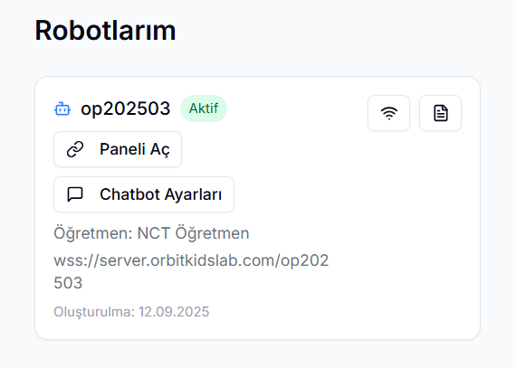

## Başlangıç
### Sistem Gereksinimleri
Herhangi bir pakete veya indirme aracına gereksinim yoktur. Bir adet tarayıcı ve internet bağlantısı yeterlidir.

### Kayıt Olma
#### Öğretmen Kaydı
Öğretmen olarak kayıt olmak için bir adet e-mail ve şifre girilmesi gerekir.

#### Öğrenci Kaydı
Öğrenci kaydı, öğretmen tarafından verilen oda numarası (ROOM CODE) ile giriş yaptıktan sonra, öğrencinin ismi NICKNAME olarak girilerek oluşturulur.
## Öğretmen Paneli
##### Rooms
Odalar *Basic* ve *Medium* olmak üzere iki kategoriye ayrılmaktadır.  
!!! warning "DİKKAT"
    Oluşturma sürecinde her iki kategori için de aynı adımlar uygulanır; söz konusu ayrım, basic odada basic görev, medium odada medium görev tanımlanmasıyla görevlerin sistemde seviyelerine göre sınıflandırılmasına yöneliktir.

##### Basic Task Oluşturma
<iframe width="560" height="315"
    src="https://www.youtube.com/embed/QD5ic5xB__4" 
    title="YouTube video player"
    frameborder="0"
    allow="accelerometer; autoplay; clipboard-write; encrypted-media; gyroscope; picture-in-picture"
    allowfullscreen>
</iframe>
  
##### Medium Task Oluşturma
<iframe width="560" height="315"
    src="https://www.youtube.com/embed/-2Ut-s4M_SQ" 
    title="YouTube video player"
    frameborder="0"
    allow="accelerometer; autoplay; clipboard-write; encrypted-media; gyroscope; picture-in-picture"
    allowfullscreen>
</iframe>

##### Basic Task'in Robot Üzerinde Çalıştırılması
<iframe width="560" height="315"
    src="https://www.youtube.com/embed/AxAg6ZONfr4" 
    title="YouTube video player"
    frameborder="0"
    allow="accelerometer; autoplay; clipboard-write; encrypted-media; gyroscope; picture-in-picture"
    allowfullscreen>
</iframe>

##### Medium Task'in Robot Üzerinde Çalıştırılması

##### Robots 

Admin tarafından eklenen öğretmenin çalıştığı robotun görüntülendiği sayfadır. Open Panel ile kontrol paneline bağlanılır.     

## Öğrenci Paneli

### Basit Görevin Kodlanması

    <iframe width="560" height="315"
        src="https://www.youtube.com/embed/F0QlPf13xc4" 
        title="YouTube video player"
        frameborder="0"
        allow="accelerometer; autoplay; clipboard-write; encrypted-media; gyroscope; picture-in-picture"
        allowfullscreen
    </iframe>

!!! info "İKONLAR"
    | İKON | İSİM | GÖREV |
    |:-----|:----:|------:|
    | { width=60px } | Yeşil Bayrak | Programı başlatmak için kullanılır. |
    | { width=60px } | Kırmızı Bayrak | Programı durdurmak için kullanılır. |
    | { width=60px } | İleri | Robotu bir adım ileri götürür. |
    | { width=60px } | Sağa Dönüş | Robotu sağa döndürür. |
    | { width=60px } | Sola Dönüş | Robotu sola döndürür. |
    | { width=60px } | Döngü | İçine yazılan komutları tekrar tekrar çalıştırmayı sağlar. |
    | { width=60px } | Sıcaklık Ölçümü | Ortam sıcaklığını ölçer. |
    | { width=60px } | Ses Kaydı | Öğrencinin mikrofon aracılığıyla ses kaydetmesini sağlar. |

### Medium Görevin Kodlanması

    <iframe width="560" height="315"
        src="https://www.youtube.com/embed/ZCj5bfg4zHA" 
        title="YouTube video player"
        frameborder="0"
        allow="accelerometer; autoplay; clipboard-write; encrypted-media; gyroscope; picture-in-picture"
        allowfullscreen
    </iframe>

